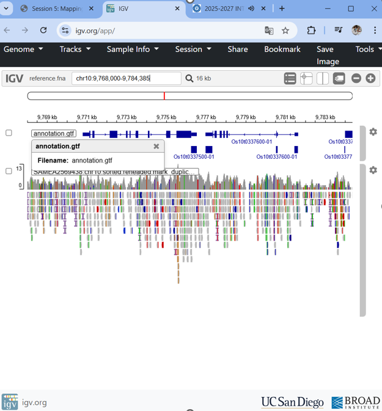
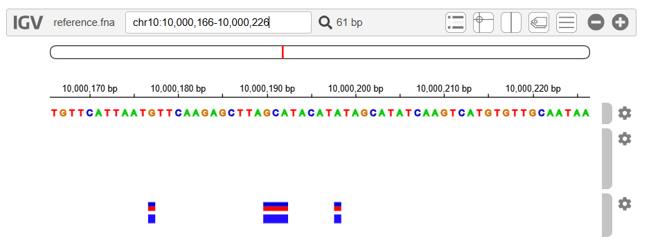

**Exercise 1**

#1.1 Note that there are 2 FASTQ files with the same name but different numeric suffix, why?
The numeric suffix distinguishes forward and reverse reads from the same sample. In paired-end sequencing, each DNA fragment is sequenced from both ends, generating two files that correspond to the same fragment pool but opposite ends.
SAMEA2569438.chr10_**1**.fastq.gz
SAMEA2569438.chr10_**2**.fastq.gz

#1.2 Check first SAMEA2569438.chr10_1.fastq.gz and then SAMEA2569438.chr10_2.fastq.gz, can you spot * the difference? Do you recognize the typical FASTQ format of these files?
Both files are standard FASTQ files, having 4 lines: read identifier (@), nucleotide sequence, starts with +, ASCII-encoded qualit scores for each base.
Both are the same but, se sequences are diferent because are complementary, SAMEA2569438.chr10_**2**.fastq.gz has the sequences of the opposite strand.

#1.3 Are read starts and ends similar in terms of error rate?
Illumina sequencing arreo rates are not uniform, are usually lower at the start, and increase toward the 3’ end. 

**Exercise 2**
#2.1 Compare the different file sizes for each of the alignment files generated in the previous section (formats SAM, BAM and CRAM).
In this case, there isn’t much difference, but normally CRAM takes up much less space because it uses the reference information and only stores the positions where there are differences; it doesn’t store the entire read. It only tells you where the differences are and at which positions. This is useful when working with large amounts of data.

| Format   | Size Relative                     | Reason                                                              |
| -------- | --------------------------------- | ------------------------------------------------------------------- |
| **SAM**  | Largest                           | Plain text, stores all information, not compressed                  |
| **BAM**  | Smaller (~3–4× smaller)           | Binary compression of SAM                                           |
| **CRAM** | Smallest (~2–3× smaller than BAM) | Reference-based compression; only stores differences from reference |

**Exercise 3**
#3.1 Using samtools mpileup estimate the percentage of chr10 with depth > 100.
```
samtools mpileup -f reference.fna SAMEA2569438.chr10.sorted.bam | \
awk '{if($4>100) high++} END {print "Porcentaje de chr10 con depth > 100: " (high/NR)*100 "%"}' chr10.pileup
Porcentaje de chr10 con depth > 100: 1.29791%
```
means that only about 1.3% of the positions on chromosome 10 have a sequencing depth greater than 100 in your sorted and re-headed BAM file.

** Exercise 4**
#The online version of the Integrative Genomics Viewer (IGV) is a useful interactive tool to explore visually the genomic data resulting from your analysis (Robinson et al. 2011). We are going to use it in this section of the session to display the alignments we have generated.
#We won’t be using the Docker container now, instead you can use a Web browser from the WSL terminal, such as firefox, or a native Web browser to access the persistent data path, which should be similar to
```
\\wsl.localhost\Ubuntu\home\_username_\vep_data
```
#4.1 Outside Docker, open the URL https://igv.org/app in a browser and check the docs.
#4.2 Load the reference FASTA and index files with the Genome->Local File option.
#4.3 Load the gene annotation GTF file with the Tracks->Local File option.
#4.4 Load the BAM and index files with sorted, mapped reads with the Tracks->Local File option.
#4.5 Go to the chr location 10:9,768,000-9,784,000 and zoom in to display the reads, should look like:
 

**Exercise 5**
#As in the previous exercise, we will use again the online version of the Integrative Genomics Viewer at https://igv.org/app . We won’t be using the Docker container; instead you can use a Web browser from the WSL terminal, such as firefox, or a native Web browser to access the persistent data path, which should be similar to
```
\\wsl.localhost\Ubuntu\home\_username_\vep_data
```
#5.1 Outside Docker, open the URL https://igv.org/app in a browser.
#5.2 Load the reference FASTA and index files with the Genome->Local File option.
#5.3 Load the gene annotation GTF file with the Tracks->Local File option.
#5.4 Load the filtered VCF file with the variants with the Tracks->Local File option.
#5.5 Take a look to INDEL variant at 10:9,058,200-9,058,229. What are the reference and alternative alleles? It this position heterozygous in your mapped sample?
Reference: CAAAGGC
Indel: CAAAAGGC
Zygosity   Homozygous variant

#5.6 Check the SNPs at 10:9,059,325-9,059,426. Are they all similar in terms of read dpeth (DP)?
It ranges between 8 and 5; but, in human genetics, they are considered equal.

#5.7 Examining the aligned reads supporting the SNPs at 10:10,000,166-10,000,226 by loading the BAM and index files. Do any of these fall into a gene model? Save the resulting image.
No
 

